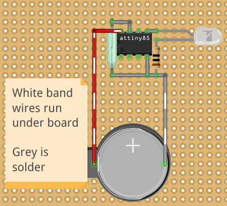
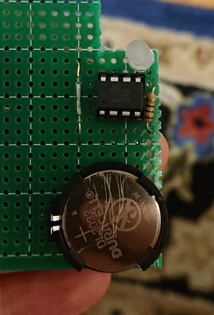

# lantern-wall
Documentation for a glowing lantern wall

## Summary
While decorating my apartment, I decided to leverage a picture rail and attempted to make a wall of [Cloud Clouds][]

[Cloud Clouds]: https://learn.sparkfun.com/tutorials/led-cloud-connected-cloud

During the process, I realized that clouds would look too bulky for what I wanted as well as require a lot more thought to power/illumination

Now the result is one-off perf-boards with a CR2032 battery, LED, switch, and weak resistor

**Off:**

**On, room lights on:**

**On, room lights off:**

**All photos:**

<https://drive.google.com/drive/folders/1h23Px1IOjGWnXOu8yB6WGrw3N42IKGuf?usp=sharing>

## Hardware
Each lantern has 1 or 2 boards in it. The boards are made out of perfboard so I have some rigidity and get some solder practice (I'm new to electronics)

**Circuit photo:**

**Board components:**

- Perfboard, https://www.adafruit.com/product/2670
    - 1 perfboard used to create six boards
    - Effective price: $0.08/LED board
- CR2032 holder, https://www.amazon.com/gp/product/B00NQB2UNU/
    - Effective price: $0.60/LED board
- CR2032 batteries, https://www.amazon.com/gp/product/B071D4DKTZ/
    - Effective price: $0.70/LED board
- LEDs, https://www.amazon.com/gp/product/B01AUI4VSI/
    - We modified these with 400 grit sandpaper to diffuse them
    - Effective price: $0.08/LED board
- 10 ohm resistors, https://www.amazon.com/gp/product/B072BL2VX1/
    - Effective price: $0.02/LED board
- Switch, https://www.amazon.com/gp/product/B007QAJST6/
    - Effective price: $0.13/LED board

**Non-board components:**

- Lanterns, https://www.amazon.com/gp/product/B01M63OEBF/
- Picture rail hooks, bought at local hardware store
- String, bought at local sewing store

**Total prices:**

- Total price per LED board: $1.61
- LED boards made, excluding early lessons: 12
- Total price for entire project: $32.32

## Pros
- Boards are tiny and fit smallest lanterns
    - Had trouble finding something off the shelf, hence the boards

## Cons
- CR2032's aren't reusable
- Current for LEDs gets lower over time
    - Due to being new to electronics, I didn't realize batteries aren't constantly at their nominal output voltage
    - As a result CR2032 starts at 3.3V but then gets down to 2.7V
    - The result is the LED draws ~20mA then down to ~3mA leading in 10x dimmer brightness

## If I were to do it again
- Use lithium polymer batteries
    - Would maximize current and allow recharging

## Documentation
### Photos
We've uploaded all the photos from this project to Google Drive. The dates will correlate with the notes here

<https://drive.google.com/drive/folders/1h23Px1IOjGWnXOu8yB6WGrw3N42IKGuf?usp=sharing>

### October 14 2017
Hung up initial lanterns on picture rail utilizing string + tape to find ideal height

We also tried out using cotton on a cloud but didn't like the result so we left it as is for now

**Notes:**

- [2017-10-14-initial-hanging-readme.md](2017-10-14-initial-hanging-readme.md)
- [2017-10-14-dye-considerations.png](2017-10-14-dye-considerations.png)

### December 03 2017
Walking through Chinatown I saw this lantern display and took a photo

I don't think I ever registered it as the inspiration for this project but it probably was subconciously

### March 30 2018
Performed lighting tests for a single LED in a lantern, utilizing a breadboard

Figuring out logistics for putting a battery and board inside of the smallest lantern

**Notes:**

- [2018-03-and-04-planning.txt](2018-03-and-04-planning.txt)

### April 04 2018
All necessary parts arrived, soldered up our first board

My soldering inexperience is showing here with lots of doubly-thick solder runs

However it worked and I was thrilled

**Notes:**

- [2018-04-04-first-light.txt](2018-04-04-first-light.txt)

## April 10 and 11 2018
Taking time to explore new solder and research getting a respirator

It definitely made me more confident in future soldering and have a better understanding of what is going on

**Notes:**

- [2018-04-10-soldering-notes.txt](2018-04-10-soldering-notes.txt)
- [2018-04-11-deciding-on-respirator.txt](2018-04-11-deciding-on-respirator.txt)

## April 15 2018
Lots of things happening that day:

- Tried out new respirator with quick latch
    - Quick latch is soooo useful
- Soldered another board
- Noticed lighting in lantern was weird
- Contemplated different hanging/insertion approaches to fix directionality
- Proof of concept showed that it didn't matter where light was, it was a lack of diffusion causing issue
- Diffused the LED via 400 grit sandpaper, worked great in proof of concept
- Made a board with diffused LED, worked great
- Explored color ideas on computer
- Started to build proof of concept color circuits but it got too late

**Notes:**

- [2018-04-15-respirator-fitting.txt](2018-04-15-respirator-fitting.txt)
- [2018-04-15-making-boards.txt](2018-04-15-making-boards.txt)
- [2018-04-15-lighting-explore.png](2018-04-15-lighting-explore.png)
- [2018-04-15-lighting-explore-cool-colors.png](2018-04-15-lighting-explore-cool-colors.png)
- [2018-04-15-lighting-explore-cool-colors-without-uv.png](2018-04-15-lighting-explore-cool-colors-without-uv.png)
    - Went with non-UV variant to avoid freaking people out due to length UV exposure (despite likely being harmless UVA)

## April 22 2018
- Tried out a new solder to avoid splatter, still getting some splatter
    - Advice/feedback here would be much appreciated. Iron is at 750F, solder is lead-free rosin core 2%
- Tried out finding minimal resistance for LED via potentiometer :sparkles:
- Tried out color proof of concept with throwie-esque LEDs

**Notes:**

- [2018-04-22-color-proof-of-concept.txt](2018-04-22-color-proof-of-concept.txt)
- [2018-04-22-new-solder.txt](2018-04-22-new-solder.txt)
- [2018-04-22-resistance-testing.txt](2018-04-22-resistance-testing.txt)

## April 23 2018
Realized that CR2032 would need to be replaced at some point and isn't recharagable. Started a battery test to see how voltage, current, and battery life hold up over time. It's been still going as of 2018-04-29 ._.

**Notes:**

- [2018-04-23-battery-test.txt](2018-04-23-battery-test.txt)

## April 24, 26, 28, and 29 2018
Soldered remaining boards and hung them up to get our final product. Also did some calculations to see how much longer the battery test would go on for

- [2018-04-24-more-soldering.txt](2018-04-24-more-soldering.txt)
- [2018-04-26-even-more-soldering.txt](2018-04-26-even-more-soldering.txt)
- [2018-04-28-battery-test-visualization.xls](2018-04-28-battery-test-visualization.xls)
- [2018-04-29-final-hanging.txt](2018-04-29-final-hanging.txt)

Final product:

**Off:**

**On, room lights on:**

**On, room lights off:**

## October 2018
We revisited the project to make it easier to turn lights on/off. The old process was:

- Wiggle circuit out of lantern
- Toggle switch
- Wiggle circuit back into lantern

Wiggling can take an annoying amount of time

We did some research and settled on the following triggering our lanterns:

- Magnetic reed switches, https://www.amazon.com/gp/product/B07239WZGF/
    - Effective price: $0.45/board
    - Buying excess of these is necessary as they are fragile and easily break when affixing to existing circuits
- Bar magnets, https://www.amazon.com/gp/product/B00BZ9YU88/
    - Effective price: $1.06/lantern

We can now slide in/out the bar magnet on the bottom of the lantern which is marginally easier and still consumes no power

## May 2020
After enough time, we found inserting/removing magnets each time was tedious to do for all 9 boards

We considered many alternatives (e.g. pull cord switch, capacitive touch, solid-state relays) and for a long time thought that low-current draw would be too high

We were wrong about low-current draw being too much, as 0.1uA from an [ATtiny85][] works great for our purposes =)

We settled on the [ATtiny85][] as opposed to other ICs for the following reasons:

- Through-hole solid-state relays draw more current in quiescent state (at least 1uA, vs 0.1uA for ATtiny @ 3.3V)
    - Example: https://www.digikey.com/product-detail/en/toshiba-semiconductor-and-storage/TLP222AF/TLP222AF-ND/871243
- Battery is only 200mAh so 2 years of idling drains 1% (~2mAh; `0.1uA * 1mA/1000uA * 2y * 365d/1y * 24h/365d`) vs 10% for `1uA`
- Easy wiring with built-in pull-up resistor for interrupt
- Discovered `PIC12F629` too late, which allows for `1nA` current on sleep, but already had ATtiny/AVR programmer
    - https://www.jameco.com/Jameco/Products/ProdDS/223790.pdf

We were also excited about features like:

- Keeping LED on while ATtiny is asleep (only works for `digitalWrite`/`HIGH`, no `analogWrite`/PWM support)
- Potential to use for twinkling (contrary to previous line)
- Potential to use for RGB LEDs, once we more thoroughly learn about power requirements and battery options

[ATtiny85]: https://www.microchip.com/wwwproducts/en/ATtiny85

We prototyped and created new boards with this setup, detailed info can be found in `2020-05-magnet-toggle.txt`

Additionally an [Arduino][] sketch and perfboard [Fritzing][] layouts can be found in the corresponding `magnet-toggle` folder

> Using Fritzing after our first couple boards significantly sped up production since we didn't have to overthink placement as much

[Arduino]: https://www.arduino.cc/
[Fritzing]: https://fritzing.org/home/

Bill of Materials (BOM) per 1 LED board:

- 7x9cm single sided perfboard, $0.75 each, https://www.mdfly.com/products/5pcs-hq-7-9cm-single-side-prototype-board-perforated-2-54mm-plated-breadboard.html
    - Can use a much smaller size in practice and pad out edges with cardboard underneath
- 8 pin DIP socket, $0.12 each, https://www.jameco.com/webapp/wcs/stores/servlet/ProductDisplay?langId=-1&storeId=10001&catalogId=10001&productId=51571
    - Kind of sticky to microcontrollers, recommend buying [DIP IC extractor](https://www.jameco.com/webapp/wcs/stores/servlet/ProductDisplay?langId=-1&storeId=10001&catalogId=10001&productId=16838) as well
- ATtiny85, $1.75 each, https://www.jameco.com/webapp/wcs/stores/servlet/ProductDisplay?langId=-1&storeId=10001&catalogId=10001&productId=2151312
- CR2032 holder, $0.55 each, https://www.jameco.com/webapp/wcs/stores/servlet/ProductDisplay?langId=-1&storeId=10001&catalogId=10001&productId=355434
    - These were much less brittle than the earlier versions we bought, very satisfied
- Reed switch - normally open, $0.50 each, https://www.mdfly.com/products/hq-2-7x14mm-reed-switch-no-pack-of-2.html
    - Highly recommend plastic over glass as glass can break easily during handling
- LEDs, $0.40 at most each
    - White, failed to get right brightness+color temperature from Jameco, went back to Chanzon, https://smile.amazon.com/gp/product/B01AUI4VSI/
    - Green, leftover from first iteration, https://smile.amazon.com/gp/product/B01AUI4VSI/
    - Blue, https://www.jameco.com/webapp/wcs/stores/servlet/ProductDisplay?langId=-1&storeId=10001&catalogId=10001&productId=2274839
- 10 ohm resistor, $0.06 each, https://www.jameco.com/webapp/wcs/stores/servlet/ProductDisplay?langId=-1&storeId=10001&catalogId=10001&productId=690380
- Not listed: Solid core wire, solder, etc

## Unlicense
As of Apr 29 2018, Todd Wolfson has released this repository and its contents to the public domain.

It has been released under the [UNLICENSE][].

[UNLICENSE]: UNLICENSE
