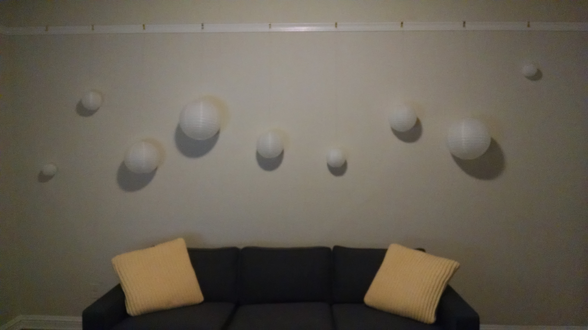
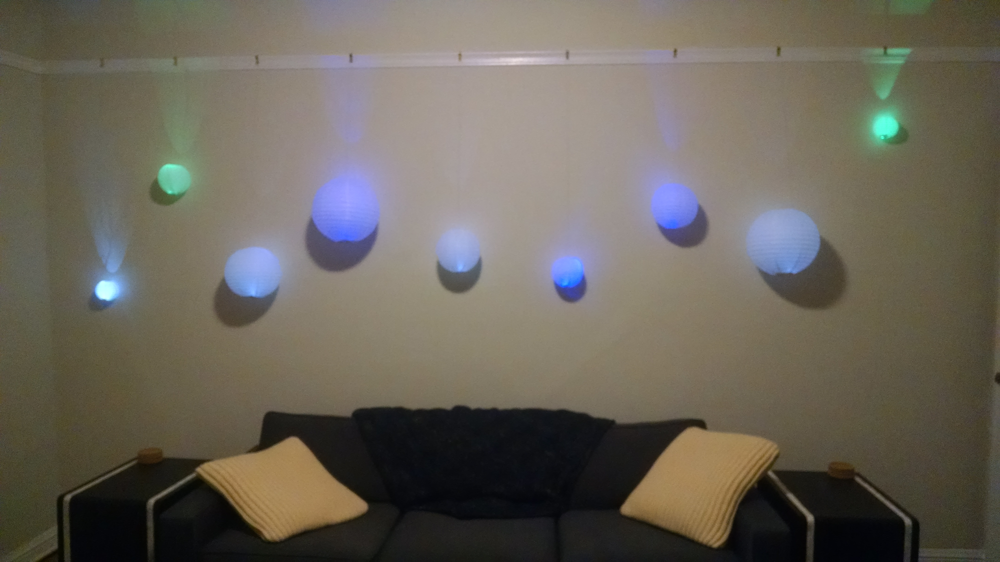
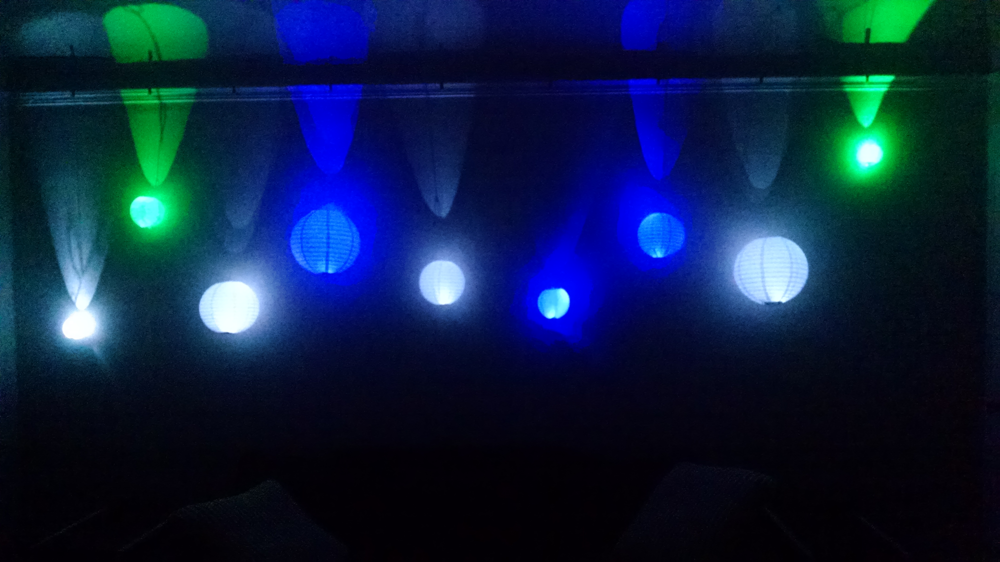

# lantern-wall
Documentation for a glowing lantern wall

## Summary
While decorating my apartment, I decided to leverage a picture rail and attempted to make a wall of [Cloud Clouds][]

[Cloud Clouds]: https://learn.sparkfun.com/tutorials/led-cloud-connected-cloud

During the process, I realized that cloud clouds would look too bulky for what I wanted as well as require a lot more thought to power/illumination

Now the result is one-off perf-boards with a CR2032 battery, LED, switch, and weak resistor

**Off:**

**On, room lights on:**

**On, room lights off:**

## Documentation
*Coming soon!*

## Unlicense
As of Apr 29 2018, Todd Wolfson has released this repository and its contents to the public domain.

It has been released under the [UNLICENSE][].

[UNLICENSE]: UNLICENSE
