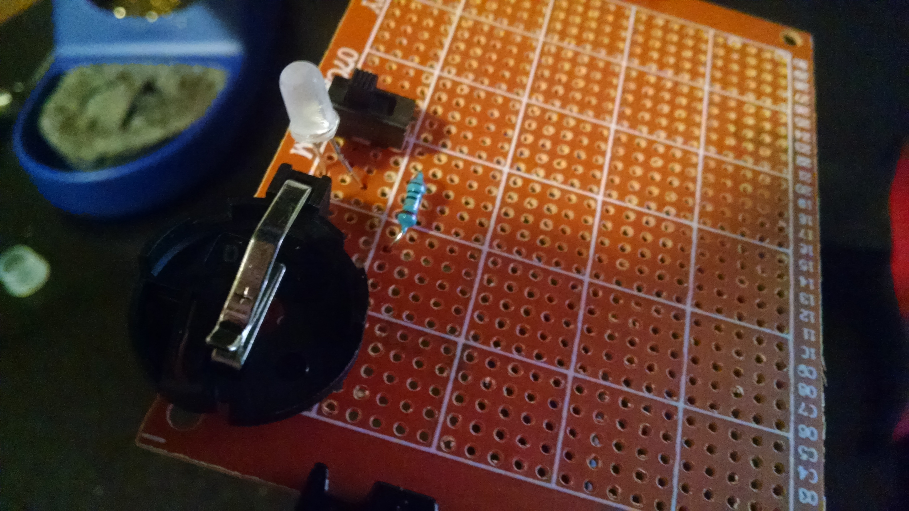

# lantern-wall
Documentation for a glowing lantern wall

## Summary
While decorating my apartment, I decided to leverage a picture rail and attempted to make a wall of [Cloud Clouds][]

[Cloud Clouds]: https://learn.sparkfun.com/tutorials/led-cloud-connected-cloud

During the process, I realized that clouds would look too bulky for what I wanted as well as require a lot more thought to power/illumination

Now the result is one-off perf-boards with a CR2032 battery, LED, switch, and weak resistor

**Off:**

**On, room lights on:**

**On, room lights off:**

## Hardware
Each lantern has 1 or 2 boards in it. The boards are made out of perfboard so I have some rigidity and get some solder practice (I'm new to electronics)

**Circuit photo:**

**Board components:**

- Perfboard, https://www.adafruit.com/product/2670
    - 1 perfboard used to create six boards
    - Effective price: $0.08/LED board
- CR2032 holder, https://www.amazon.com/gp/product/B00NQB2UNU/
    - Effective price: $0.60/LED board
- CR2032 batteries, https://www.amazon.com/gp/product/B071D4DKTZ/
    - Effective price: $0.70/LED board
- LEDs, https://www.amazon.com/gp/product/B01AUI4VSI/
    - We modified these with 400 grit sandpaper to diffuse them
    - Effective price: $0.08/LED board
- 10 ohm resistors, https://www.amazon.com/gp/product/B072BL2VX1/
    - Effective price: $0.02/LED board
- Switch, https://www.amazon.com/gp/product/B007QAJST6/
    - Effective price: $0.13/LED board

**Non-board components:**

- Lanterns, https://www.amazon.com/gp/product/B01M63OEBF/
- Picture rail hooks, bought at local hardware store
- String, bought at local sewing store

**Total prices:**

- Total price per LED board: $1.61
- LED boards made, excluding early lessons: 12
- Total price for entire project: $32.32

## Pros
- Boards are tiny and fit smallest lanterns
    - Had trouble finding something off the shelf, hence the boards

## Cons
- CR2032's aren't reusable
- Current for LEDs gets lower over time
    - Due to being new to electronics, I didn't realize batteries aren't constantly at their nominal output voltage
    - As a result CR2032 starts at 3.3V but then gets down to 2.7V
    - The result is the LED draws ~20mA then down to ~3mA leading in 10x dimmer brightness

## If I were to do it again
- Use lithium polymer batteries
    - Would maximize current and allow recharging

## Documentation
*Coming soon!*

## Unlicense
As of Apr 29 2018, Todd Wolfson has released this repository and its contents to the public domain.

It has been released under the [UNLICENSE][].

[UNLICENSE]: UNLICENSE
